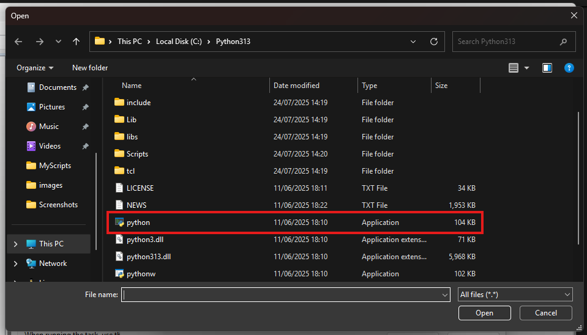

# Cookie Collector

A Python automation toolkit for managing browser sessions and automating various website interactions using Playwright/Selenium.

## Table of Contents

- [Requirements](#requirements)
- [Installation](#installation)
- [Available Modules](#available-modules)
  - [Update Resume on Naukri](#update-resume-on-naukri)
- [General Usage](#general-usage)
- [Module-Specific Instructions](#module-specific-instructions)
  - [Naukri Resume Update](#naukri-resume-update)
- [Testing](#testing)
- [Scheduling Using Task Scheduler](#scheduling-using-task-scheduler)
- [Troubleshooting](#troubleshooting)
- [Coming Soon](#coming-soon)

## Requirements
- [Python 3.7+](https://www.python.org/downloads/) - Download and install if not already installed
- [pip](https://pip.pypa.io/en/stable/installation/) - Package installer (usually comes with Python)
- Chrome browser
- Internet connection

## Installation

1. Clone the repository:
```bash
git clone https://github.com/Syedmahmood777/Scripts.git
```

2. Navigate to the scripts directory:
```bash
cd scripts
```

3. Install the required dependencies:
```bash
pip install -r requirements.txt
```

4. Install Playwright browsers:
```bash
python -m playwright install
```

## Available Modules

### Update Resume on Naukri
Automatically updates your resume on Naukri.com at scheduled intervals to improve visibility and ranking.

**Status:** ✅ Available

## General Usage

Cookie Collector saves all your browser sessions, so automation doesn't require you to log in every time it runs. This makes the process seamless and efficient.

### Initial Setup

1. **Create Browser Profile**: You must log in to all accounts you want to use on every website. Your session data will be saved under `.profiles` directory using the profile name you specify.

2. **Run the Cookie Collector**:
```bash
python cookie_collector.py your_profile_name https://www.naukri.com
```

3. **Login Process**: After running the script, log in to your account through the automated browser window then close the window once logged in.

## Module-Specific Instructions

### Naukri Resume Update

#### Setup Instructions

1. **Get Your Profile URL**:
   - Go to your Naukri profile  
   
   - Navigate to the page where you can see your profile and the "Update Resume" button  
   

   - Copy the complete URL from the address bar (it should be like 'https://www.naukri.com/mnjuser/profile?id=&altresid' )

2. **Configure the Script**:
   Open `update_naukri.py` and update the following 4 fields:

```python
# 1. Profile Directory Path
PROFILE_DIR = Path("YOUR_ABSOLUTE_PROFILE_PATH_HERE")

# 2. Your Naukri Profile URL
await page.goto("https://www.naukri.com/mnjuser/profile?id=&altresid", timeout=60_000)
# Replace with the profile URL you copied from your Naukri profile

# 3. Resume File Paths
resume_files = [
    rf"C:\Users\syedm\Downloads\Syed_NCV.pdf",
    rf"C:\Users\syedm\Downloads\Syed_SE.pdf"
]
# Add your resume paths here. You can have multiple resumes to choose from,
# or just keep one path in the list

# 4. Log File Path
log_path = rf"C:\Users\syedm\OneDrive\Desktop\Scripts\log.txt"
# Path to your log file. Should be in the same folder as the script.
# Copy the path to your root folder and add 'log.txt' at the end
```

> **Important**: Make sure all paths are absolute (full paths) rather than relative paths.

## Testing

### Test Naukri Resume Update

Run the following command to test the Naukri module:

```bash
python update_naukri.py
```
## Scheduling Using Task Scheduler

### Step 1: Open Task Scheduler

#### Method 1: Using Start Menu
1. Click on the **Start Menu**
2. Type "Task Scheduler" in the search bar
3. Click on **"Task Scheduler"** when it appears


#### Method 2: Using Run Dialog
1. Press **Win + R** to open the Run dialog
2. Type `taskschd.msc` and press Enter


### Step 2: Create a New Task

1. In the Task Scheduler window, look at the **Actions** panel on the right side
2. Click on **"Create Task"** (not "Create Basic Task")


### Step 3: General Tab - Name Your Task

1. In the **General** tab, enter a descriptive name for your task (e.g., "Naukri Profile Updater")
2. Add a description (optional but recommended)


### Step 4: Triggers Tab - Set Schedule

1. Click on the **"Triggers"** tab
2. Click **"New..."** button to create a new trigger


3. In the New Trigger dialog:
   - Set **"Begin the task"** to **"On a schedule"**
   - Choose **"Daily"** for daily execution
   - Set your **Start date and time**
   - Under **Advanced settings**, check **"Repeat task every"**
   - Set the interval (e.g., 1 hour, 2 hours, etc.)


4. Click **"OK"** to save the trigger

### Step 5: Actions Tab - Configure Python Script

1. Click on the **"Actions"** tab
2. Click **"New..."** to create a new action


3. In the New Action dialog:
   - Keep **Action** as **"Start a program"**
   - Click **"Browse..."** next to Program/script field


### Step 6: Select Python Executable

1. Navigate to your Python installation directory:
   - `C:\Python313\python.exe`
   - `C:\Users\[YourUsername]\AppData\Local\Programs\Python\Python313\python.exe`

2. Select `python.exe` and click **"Open"**



### Step 7: Add Script Path as Arguments

1. In the **"Add arguments (optional)"** field, enter the full path to your Python script:
   ```
   "C:\path\to\your\update_naukri.py"
   ```

2. In the **"Start in (optional)"** field, enter the directory containing your script:
   ```
   C:\path\to\your\
   ```


3. Click **"OK"** to save the action

### Step 8: Save the Task

1. Click **"OK"** to create the task


### Step 9: Test Your Task

1. In the Task Scheduler Library, find your newly created task
2. Click on the task name
3. Select **"Run"** to test immediately


4. Check the **"log.txt"** to verify success

## Troubleshooting

- **Login Issues**: If you're prompted to log in repeatedly, ensure your profile was saved correctly during the initial setup
- **Path Errors**: Double-check that all file paths are absolute and the files exist
- **Browser Issues**: Make sure Chrome is installed and up to date
- **Network Issues**: Ensure stable internet connection during automation

## Coming Soon

- **LinkedIn Job Scrape** 🔄
- **Job Classifier** 🔄


---

## License

This project is for educational and personal use only. Please respect the terms of service of the websites you're automating.

---

**Note**: Always ensure you comply with the terms of service of the websites you're automating. This tool is intended for legitimate personal use only.